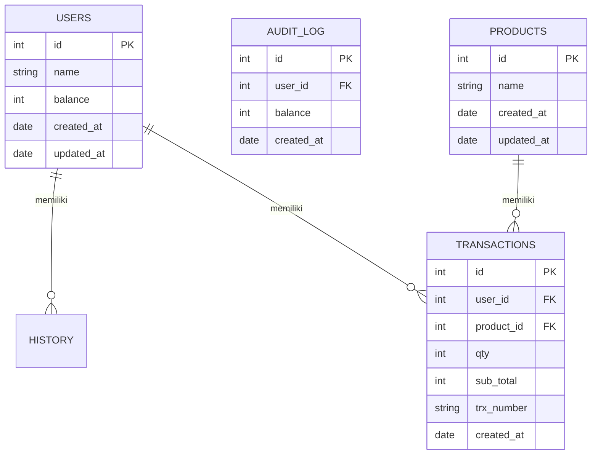

# ERD E-Wallet

```mermaid
erDiagram
  USERS {
    int id PK
    string name
    int balance
    date created_at
    date updated_at
  }
  AUDIT_LOG {
    int id PK
    int user_id FK
    int balance
    date created_at
  }
  TRANSACTIONS {
    int id PK
    int user_id FK
    int product_id FK
    int qty
    int sub_total
    string trx_number
    date created_at
  }
  PRODUCTS {
    int id PK
    string name
    date created_at
    date updated_at
  }

  USERS || -- o{ HISTORY : memiliki
  USERS || -- o{ TRANSACTIONS : memiliki
  PRODUCTS || -- o{ TRANSACTIONS : memiliki

```